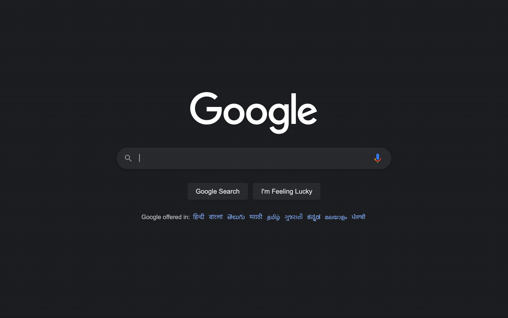

# Indic Type Chrome Plugin

> WIP: not yet published to the chrome store

Indic Type enables you to type in 30+ supported languages anywhere!

### Supported languages

Amharic, Arabic, Bangla, Belarusian, Bulgarian, Chinese (Hong Kong), Chinese (Simplified), Chinese (Traditional), French, German, Greek, Gujarati, Hebrew, Hindi, Italian, Japanese, Kannada, Malayalam, Marathi, Nepali, Odia, Persian, Portuguese (Brazil), Punjabi, Russian, Sanskrit, Serbian, Sinhala, Spanish, Tamil, Telugu, Tigrinya, Ukrainian, Urdu, Vietnamese

### Contributing

Checkout the open issues to contribute to the project. Checkout CONTRIBUTING.md for development setup

### License

See LICENSE.md file
